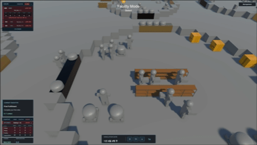
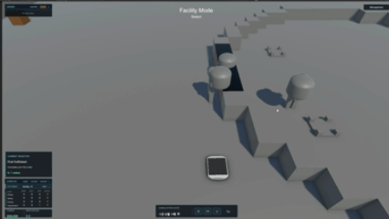
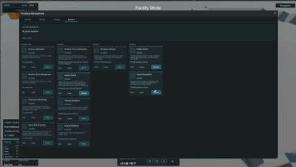

# Universe Logistics

> 달의 물류 허브를 건설하고, 입고부터 정산까지 이어지는 화물 흐름의 병목을 해결하는 물류 경영 시뮬레이션입니다.



> 🚧 **현재 개발 중인 프로젝트입니다.** 핵심 물류 루프와 주요 운영 시스템을 구현했으며, 현재는 전체 흐름의 안정화와 UI·정보 전달 개선을 진행하고 있습니다.

## 게임 소개

인류가 태양계로 진출하기 시작한 근미래, 외딴 정착지는 달의 물류 허브를 거치는 불안정한 장거리 보급망에 의존하고 있습니다.

플레이어는 허브 운영자가 되어 건물을 배치하고, 시설별 화물 처리 규칙과 작업자를 설정합니다. 하나의 건물에서 전체 공정을 처리하거나, 보관·포장·출고 기능을 여러 건물에 나누고 화물 포트(`CargoPort`)로 연결할 수 있습니다.

시설을 늘리는 것만으로 모든 문제가 해결되지는 않습니다. 비어 있는 포장 시설도 화물이 도착하지 않으면 멈추고, 작업자를 늘려도 좁은 통로가 막히면 운송이 지연됩니다. 플레이어는 화물이 멈춘 위치와 원인을 확인하고, 시설 배치·운영 규칙·작업자 배정을 조정해 흐름을 안정화합니다.

**병목을 발견하고, 운영 방식을 바꾸고, 그 결과를 실제 화물 이동으로 확인하는 것**이 핵심 플레이입니다.

## 핵심 플레이 루프

```text
입고 → 보관 → 주문 → 피킹 → 포장 → 출고 → 정산
```

| 단계 | 플레이어가 관리하는 흐름 |
|---|---|
| 입고 | 로켓 도착, 착륙 결과, 화물 하역과 Inbound CargoPort 반입 |
| 보관 | 라벨링, Capsule 이동, Rule에 맞는 Buffer·선반으로 적치 |
| 주문 | 계약 수락, 주문 생성, 품목별 수량과 납기 추적 |
| 피킹 | 주문 Manifest에 따른 재고 예약과 피킹 작업 |
| 포장 | Packing Station 투입, 포장, 완성 화물 반출 |
| 출고 | Building 적재 임계치와 Outbound CargoPort Rule에 따른 Capsule 출고 |
| 정산 | 납기와 완료 결과에 따른 수익, 평판과 페널티 반영 |

## 주요 시스템

### 1. 건물과 운영 규칙으로 구성하는 물류망

- 건물 안에 시설과 운영 규칙을 조합해 보관·포장·출고 역할을 구성합니다.
- 선반, 포장 시설, 화물 캡슐 보관 시설, 입출고 포트, 에어록, 휴게·충전 시설, 전력 및 발사 시설을 배치합니다.
- 화물 포트는 외부 운송과 건물 간 물류를 연결합니다.
- 건물 연결, 작업 범위와 캡슐 출고 조건을 설정합니다.
- 시설별 규칙(`FacilityRule`)으로 받을 품목과 화물 처리 단계를 지정합니다.

예를 들어 라벨링된 화물을 받는 보관 시설과 포장된 화물을 받는 출고 포트에 서로 다른 규칙을 지정해, 처리 상태에 따라 화물이 이동할 목적지를 구성합니다.

### 2. 눈에 보이는 작업 흐름과 작업자 운영

- 입고 하역, 라벨링, 보관, 피킹, 포장 투입·반출, 출고 정렬, 캡슐 재배치와 폐기물 수거 작업이 물류 상태에 따라 생성됩니다.
- 인간과 로봇 작업자는 능력과 담당 건물·업무에 따라 작업을 배정받습니다.
- 인간의 피로와 휴식, 로봇의 배터리와 충전이 작업 지속성과 처리량에 영향을 줍니다.
- 작업자는 실제 공간을 이동하며 화물을 운반합니다. 통로가 막히면 조건에 따라 대기·우회·양보를 시도합니다.

### 3. 계약과 운영 성장

- 계약, 주문, 납기, 정산, 자금과 평판을 관리합니다.
- 선행 조건, 연구 대기열, 비용과 기간을 관리하며 새로운 시설·정책과 작업자 행동을 순차적으로 해금합니다.
- 회사 상태와 시설·운영 조건을 평가하는 라이선스 시스템이 포함되어 있습니다.

> **연구 효과 예시** — `Human Recognition` 연구 전에는 로봇이 이동을 가로막는 인간과 충돌해 사고를 일으킬 수 있습니다. 연구 후에는 해당 충돌 처리를 건너뛰고, 교통 제어 조건에 따라 대기하거나 우회·양보를 시도합니다. `Traffic Control` 연구는 이러한 교통 조정 행동의 해금에 관여합니다.


**연구 전 — 인간과 충돌하는 로봇**



**연구 후 — 인간을 인식하고 우회하는 로봇**



### 4. 화물 상태와 운영 위험

- 전력과 건물 온도가 화물 온도, 신선도와 손상에 영향을 주며 품질이 낮아진 화물은 폐기물과 손실을 만듭니다.
- 로켓의 경착륙과 충돌, 화물 손상, 인간·로봇 작업자 사고와 의료·수리 대응이 운영을 방해할 수 있습니다.

### 5. 병목을 읽는 운영 정보

- 건물, 시설, 작업자와 화물을 선택해 요약 정보와 상세 설정을 확인합니다.
- 물류 HUD와 작업 모니터에서 공정별 수요, 대기, 진행, 반송과 차단 상태를 건물 단위로 추적합니다.
- 연결 상태와 작업 범위를 확인하는 그리드 오버레이를 제공합니다.

처리할 화물은 있지만 작업이 생성되지 않은 상황과, 작업이 생성됐지만 배정이나 이동이 막힌 상황을 구분하며 병목의 원인을 추적합니다.

## 게임 진행

현재 시나리오는 기본 주문 처리에서 시작해 연구와 콜드체인 운영으로 이어지는 목표를 순서대로 제공합니다.

1. 첫 주문을 완료합니다.
2. 주문 3건을 납기 내 완료합니다.
3. `Temperature Monitoring`과 `Thermal Operations`를 연구합니다.
4. `Traffic Control`과 `Human Recognition`을 연구합니다.
5. `Lunar Produce Cold Chain` 주문을 납기 내 완료하고 평판 50을 달성합니다.

목표가 진행되면서 연구, 교통 제어, 온도와 품질 관리가 기존 물류 흐름에 차례로 더해집니다. 목표 정의는 [DemoScenario.asset](Pang/Assets/ScriptableObjs/Scenarios/DemoScenario.asset)에서 관리합니다.

## 구현 구조

중요한 상태가 여러 객체의 숨은 부수 효과로 변경되지 않도록, 상태 소유자와 Task 생성 경로를 분리했습니다.

```text
상태 변경
→ 이벤트 / Dirty 대상 수집
→ 관련 Building·Dock 재평가
→ Workflow / Planner / CapsuleRelocateCoordinator
→ TaskManager
→ 행동 트리 Worker
→ 물리 상태·운영 지표·UI 갱신
```

- `Building`은 물리 공간과 Building 단위 운영 정책을 소유합니다.
- `Facility`는 건물 안에 설치되는 실제 작업 기능입니다.
- `FacilityRule`은 시설의 처리 조건과 허용 범위를 표현합니다.
- `CapsuleRelocateCoordinator`는 Capsule의 Rule 매칭, 상태 정규화와 재배치를 담당합니다.
- Workflow와 Planner는 필요한 일을 감지하고 자원을 예약하며, `TaskManager`는 큐와 배정 상태를 관리하고, Worker는 행동 트리로 공간상의 작업을 실행합니다.
- Dirty는 다시 판단할 대상이 생겼다는 표시입니다. 재평가 시 시설 규칙, 목적지와 자원 조건이 충족되어야 작업이 생성됩니다.
- 이벤트·Dirty 재평가와 프레임별 갱신, 시간 기반 Simulation Tick을 함께 사용합니다. 온도·산소·화재·마모·화물 열 상태 등의 시간 기반 갱신은 `SimulationTickCoordinator`가 조율합니다.

### 주요 코드

| 영역 | 코드와 책임 |
|---|---|
| 물류 공정 | [InboundWorkflowService](Pang/Assets/Scripts/Task/InboundWorkflowService.cs), [OutboundWorkflowService](Pang/Assets/Scripts/Task/OutboundWorkflowService.cs) — 입고·출고 공정별 작업 생성 조율 |
| 캡슐 라우팅 | [CapsuleRelocateCoordinator](Pang/Assets/Scripts/Task/CapsuleRelocateCoordinator.cs) — 규칙 매칭, 물류 상태 정규화와 재배치 |
| 작업 생명주기 | [TaskManager](Pang/Assets/Scripts/Task/TaskManager.cs) — 작업 큐, 배정과 반송 상태 관리 |
| 경로와 교통 | [FindRoute](Pang/Assets/Scripts/AI/FindRoute.cs) — 경로 탐색·이동, [GridService](Pang/Assets/Scripts/Map/GridService.cs) — 점유·예약, [TrafficCoordinator](Pang/Assets/Scripts/AI/TrafficCoordinator.cs) — 대기·우회·양보 조정 |
| 환경 시뮬레이션 | [SimulationTickCoordinator](Pang/Assets/Scripts/SimulationTickCoordinator.cs) — 시간 기반 환경 갱신 조율 |
| 운영 정보 | [LogisticsWorkMonitorPresenter](Pang/Assets/Scripts/UI/Toolkit/LogisticsWorkMonitorPresenter.cs) — 공정별 작업 상태 표시 |
| 저장·불러오기 | [GameSaveService](Pang/Assets/Scripts/Save/GameSaveService.cs) — 시스템별 상태 저장·복원 조율 |

## 실행 방법

### 요구 사항

- Unity `6000.5.3f1`
- Git

### 프로젝트 실행

1. 저장소를 복제합니다.
2. Unity Hub에서 저장소 안의 `Pang` 폴더를 프로젝트로 추가합니다.
3. Unity `6000.5.3f1`로 프로젝트를 열고 패키지 설치와 에셋 임포트가 완료될 때까지 기다립니다.
4. `Assets/Scenes/TitleScene.unity`를 열고 Play Mode를 시작합니다.
5. 타이틀 화면에서 새 게임을 시작합니다.

에디터 버전은 [ProjectVersion.txt](Pang/ProjectSettings/ProjectVersion.txt), 패키지 구성은 [manifest.json](Pang/Packages/manifest.json)에 기록되어 있습니다.

## 기본 조작

| 입력 | 동작 |
|---|---|
| `W` `A` `S` `D` | 카메라 이동 |
| 마우스 오른쪽 드래그 | 카메라 회전 |
| 마우스 휠 | 확대·축소 |
| `Esc` | 일시정지 메뉴 |

## 기술 정보

- Unity 6 / C#
- Universal Render Pipeline
- UI Toolkit, uGUI / TextMesh Pro 기반 UI
- `GameContext` 중심의 서비스 접근과 상태 소유권 분리
- Workflow → TaskManager → 행동 트리 Worker 파이프라인
- 그리드 기반 건설, 경로 탐색, 이동 예약과 교통 충돌 조정
- 이벤트·Dirty 재평가와 중앙 Simulation Tick을 함께 사용하는 시뮬레이션 구조
- Building, 시설, 작업자, 화물, 주문, 연구, 경제, 시나리오와 진행 중 Task를 포함하는 저장·불러오기
- Unity Test Framework 기반 테스트 코드 — [Assets/Tests](Pang/Assets/Tests)

## 문서

- [Project Identity](Pang/docs/project/identity.md)
- [Design Philosophy](Pang/docs/project/design_philosophy.md)
- [Current Gameplay Loop](Pang/docs/current/gameplay_loop.md)
- [Current Hub Structure](Pang/docs/current/hub_structure.md)
- [Current Systems](Pang/docs/current/system.md)
- [Architecture](Pang/docs/architecture/architecture.md)
- [Workflow & Workers](Pang/docs/architecture/workflow_task_worker.md)
- [Worker Traffic Coordination](Pang/docs/architecture/worker_traffic_coordination.md)
